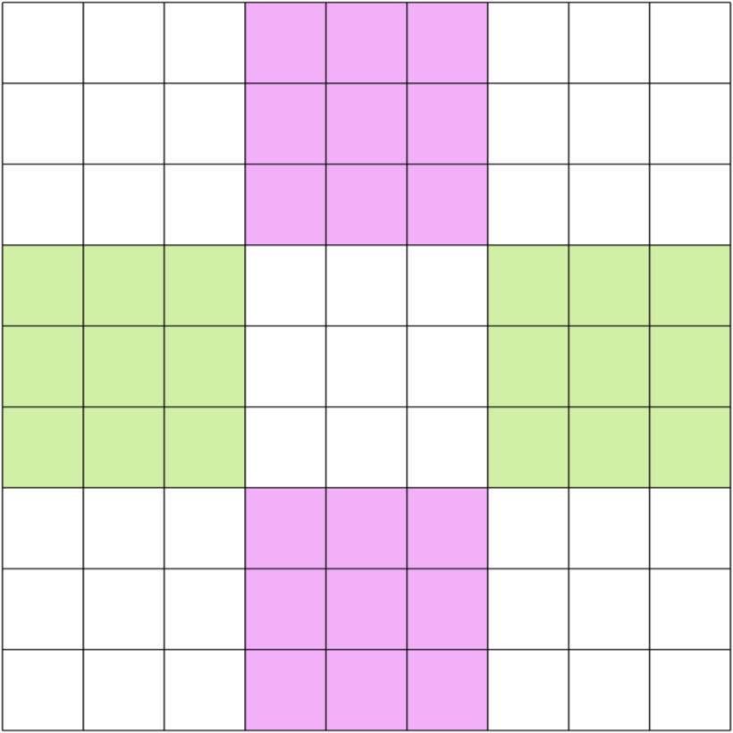
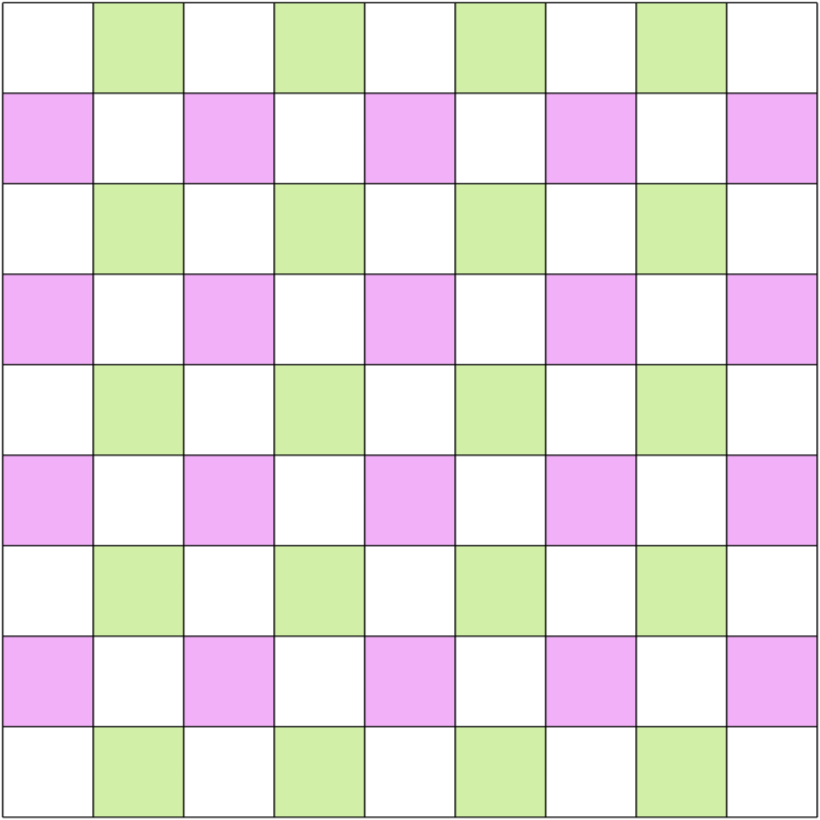

# Set Equivalence Theory
We can select sets of cells within a puzzle and compare them.

(TODO)

## Phistomefel-Ring in Sudoku
In the following schema, the digits in the blue cells are the same digits as in the yellow cells.

## Cross and Checkerboard in Latin Square
In the following schemas, the digits in the green cells are the same digits as in the purple cells.

