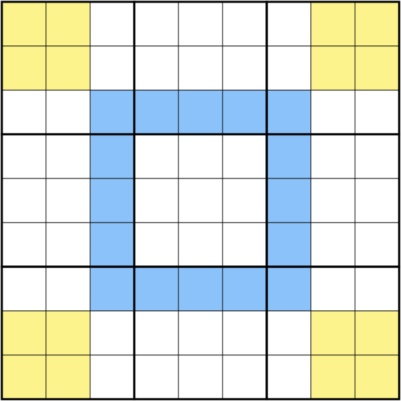

# Set Equivalence Theory
We can select sets of cells within a puzzle and compare them.

(TODO)

## Phistomefel-Ring
In the following schema, the digits in the blue cells are the same digits as in the yellow cells.

