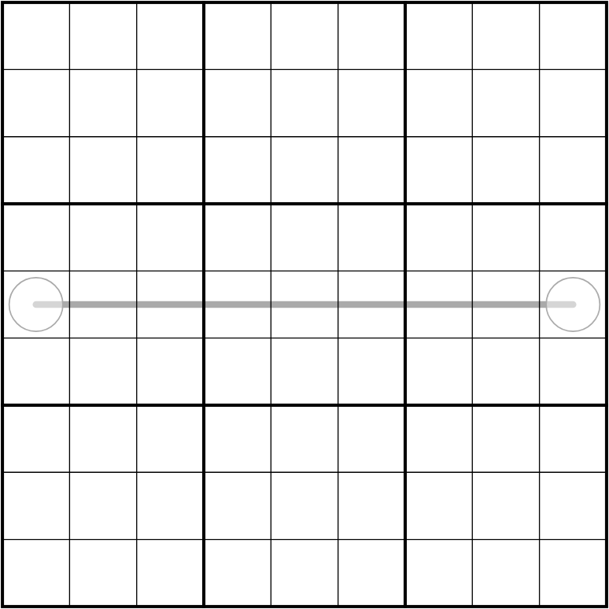

# Diadukt
## Rules
- Normal Sudoku rules apply.
- Each cell in the grid is a column indexer, e. g. a 5 in R2C1 means there is a 1 in R2C5.
- Digits along a line must be strictly between the digits in the circles at the ends of that line.
- Digits in adjacent cells along all positive diagonals (from bottom left to top right) must have a difference of at least 4.

## Origin
Experiments with indexers

## Status:
- [X] Solution included

## Links
- [SudokuMaker](https://sudokumaker.app/?puzzle=N4IgZg9gTgtghgFwGoFMoGcCWEB2IBcIAjAHQCsJADCADQgAOArgF7MA2KBoOcMnhAEUxwAJowDWCWiDiMEAC2gEQAYXlRM6ACoR689OMzSAxhBh8cUwoCICAAQA5aPDa2AyoxERxjW1EYd0Wzh6ejYATxIAHRw7AFE4Y3lbYxQ2F0wcWwUUWwBzDRFbTSDkiDZGGEyMkRQADzQaWxQSPJa4WzIizIAlACYVIls%2BOBxA7Kgc4vbBjNs%2BlQpouyFczARAuDZcXJK2DJyYRnQEWwAjHOONYwRws5QEAHcUFEzs2xFMVfWurPkc40wUGMASCJzeLxEgQgYF%2BiFsexwzSWthWa0Cs1EACsEi8Tik0hstjgdpsXPQIFgEJgAG45D5wXK4TaBAAUYCgZjOEAQCE5HDAYIgWV0vk%2B8gQAEohkcTvI4LSSh8wGA0C8UrZoaD4Sg4MdbAAWEgmVJsdAEADaoGpm0Y-DIAF8aFabfx9Y7neV%2BABmd0ga2egi9X3%2B20EIjBl0EACcEYD%2BAAHLHQ-gAOxJ-gANnTBETTr9kdT2fwWbzIbtRbdpYLPqrcaDteT4Yb-BjzcDRabHuTra7-FzvYIabbxaLDuHlYH%2BBrk5Lk7Hk4n%2Bbj06Xyfrk87q5bRf7W8HRZ7e4TRaHM9HFaLK7L7eHm%2BvU6L66Pd4Lh-vu-vp6Ps6P86Pi8-Isf3vP97wA6tHw7A8dyg4c3wLD8Cy-e9gILUCC3A5dIPHS9sI3aDh0QuNkILVC4wdABdOhTFGBAoDgDJ1gtUAEDCeh%2BEoX1WPYsM6AmVZcDNfBzUoGhRNEogaEkyTehoWTZPEsSpOUmS5LUxSJJUtT5JoL1dP0-UaEMwyyBoUzTL0yyjOskyzLsqy9OM6zzLsjMaDctyUxoLyvPjGg-L8jz3O8kLfP88Kgs80LwoCiiuLYzNKEkkB8VNC1RKjKS-N6LyvTc-VzMMjM9JTWSUz0jMTNM-U3K9Lzej8ohMqITTZL0ohZKIGTRN6TKvT8-UvLIDzTJTQyU1MjM3LILz9T8r0%2BokxyjNE-VMrIQKfM8ryMz8sh1tWySvXk9rbLcohTN6QyvUc2SyEkjNRIzTKUz8lMXqeySyFk-VLMM3pTKIKLGvq2rqpMiqysk%2BMevko6iCokBjjCDguBSsolEIABiMAo0ofGCZAe14p4-B9SSugERQITzXNSSoyounGp6xmcqk5qjsZvK5OyiSfsZgrdPqzLemkvSyEZshjNq%2BbYakorGeKszqtyvqZPa0bGdK9yTPygbROOuTDKB-ytYq8zZsy-Ujr0gGpJTLWiumvbVra-6My1yahvWyTft0iWaHNFMPMC0TvqM-UtZ2zKMy%2Br0tbep7ei1yT3ooxGYAyIRlVVHAUgIQykdY1H8FAUwtigZQcbAOBHsJugFEwYxxERdAhMoEgLuJvNuNdSg9JAKmafNbm6t0%2BarcOoyfscyPEeRkvQCHtHG%2Bb1v2876iMcr7G4D3-eiboCEAAUIEYoTQCwZgOJIPzwEwNIq%2BVZ%2BwBh6RLi8fgWPkJuW%2BpjfKCyXRhXKu%2B8D7E2JnFe0QA)
- [SudokuPad](https://sudokupad.app/o96ufvj11x)

## Preview

## Intended solution path
(TODO)
